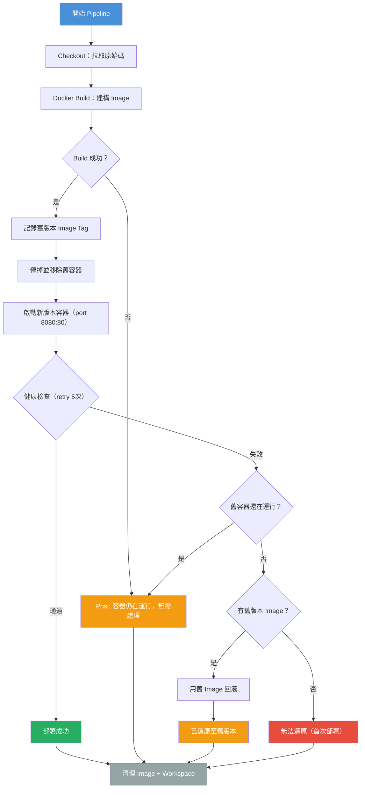

# Jenkinsfile 部署策略分析

## 部署策略：Rolling Replace with Rollback（滾動替換 + 自動回滾）

採用**單機直接替換**策略：停舊容器 → 起新容器 → 健康檢查 → 失敗自動回滾。

## Pipeline 階段

| 階段 | 說明 |
|------|------|
| **Checkout** | 從 Git 拉取原始碼 |
| **Docker Build** | Multi-stage build，產出 nginx image（標記 `BUILD_NUMBER` + `latest`） |
| **Deploy** | 記錄舊版 → 停舊容器 → 起新容器 → 健康檢查 |
| **Post Actions** | 成功/失敗處理 + image 清理 + workspace 清理 |

## 部署流程圖



## 關鍵機制

### 版本記錄與回滾
```
記錄：docker inspect prototype-spa → 取得舊 image（如 prototype-spa:18）
回滾：docker run ... prototype-spa:18  → 用舊 image 重新啟動
```

### 健康檢查
```
方式：取得容器內部 IP → curl -f http://<容器IP>:80
重試：5 次，每次間隔 3 秒（最長等待 15 秒）
原因：Jenkins 跑在 Docker 內，localhost 指向 Jenkins 自己
```

### Downtime 分析
```
停舊容器 → 起新容器 → 健康檢查通過
|_______ 約 3~5 秒 downtime _______|
```

## 策略優缺點

| 優點 | 缺點 |
|------|------|
| 流程簡單、容易維護 | 有幾秒 downtime |
| 自動回滾保護 | 單機部署，無高可用 |
| Image 版本追蹤清晰 | 回滾依賴舊 image 未被清理 |
| Docker image prune 防磁碟爆滿 | 無通知機制（Slack/Email） |

